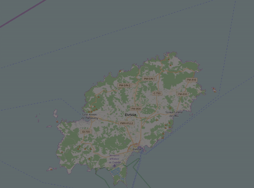
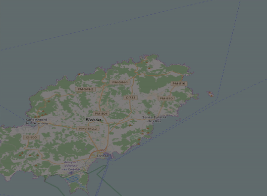
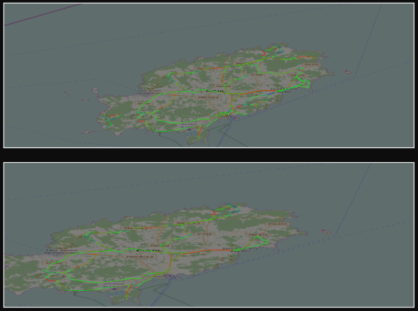

# Track Animation

**Track Animation** is a Python 2 and 3 library that provides and easy and user-adjustable way of **creating visualizations from GPS data** easily and without any kind of technical tie for the user. It allows to import GPS data from **GPX** (GPS eXchange Format) and CSV files in order to manipulate it and, finally, create **videos**, **images**, sequences of images or **interactive maps** to analyze the tracks based on their elevation, speed, duration or any other indicator.

The main third party libraries that **Track Animation** uses are [gpxpy](https://github.com/tkrajina/gpxpy) to parse and read GPX files, [pandas](http://pandas.pydata.org/) to manipulate all the GPS data and [matplotlib](https://matplotlib.org/) to plot it and save the visualizations.

To create a basic visualization, simply read the files and pass them to the *AnimationTrack* class:

```python
import trackanimation
from trackanimation.animation import AnimationTrack

input_directory = "example-routes/"
ibiza_trk = trackanimation.readTrack(input_directory)

fig = AnimationTrack(df_points=ibiza_trk, dpi=300, bg_map=True, map_transparency=0.5)
fig.makeVideo(output_file='simple-example', framerate=60, linewidth=1.0)
```




## Dependencies
* [gpxpy](https://github.com/tkrajina/gpxpy)
* [pandas](http://pandas.pydata.org/)
* [matplotlib](https://matplotlib.org/)
* [geopy](https://github.com/geopy/geopy)
* [smopy](https://github.com/rossant/smopy)
* [mplleaflet](https://github.com/jwass/mplleaflet)
* [image](http://pillow.readthedocs.io/en/3.4.x/reference/Image.html)
* [tqdm](https://github.com/noamraph/tqdm)
* [FFmpeg](https://ffmpeg.org/)


## Installation

Install **Track Animation** using [pip](http://www.pip-installer.org/en/latest/) with:

    pip install trackanimation

Or, [download the source files from PyPI](https://pypi.python.org/pypi/trackanimation).


## Getting Started

You can find the following examples in the [examples.py](examples.py) file.


### Filtering by place

It is possible to filter a set of tracks to retrieve only the points that belong to an specific place or the whole tracks that have passed by there. With the function *timeVideoNormalize*, all the tracks will start and end at the same time in the video, specyfing its duration and frame rate in the parameters. In the next example, the video created has a duration of 10 seconds with 10 frames per second.

```python
import trackanimation
from trackanimation.animation import AnimationTrack

input_directory = "example-routes/"
ibiza_trk = trackanimation.readTrack(input_directory)
sant_josep_trk = ibiza_trk.getTracksByPlace('Sant Josep de sa Talaia', only_points=False)
sant_josep_trk = sant_josep_trk.timeVideoNormalize(time=10, framerate=10)

fig = AnimationTrack(df_points=sant_josep_trk, dpi=300, bg_map=True, map_transparency=0.5)
fig.makeVideo(output_file='filtering-by-place', framerate=10, linewidth=1.0)
```




### Coloring tracks by one indicator

Furthermore, an indicator of the tracks can be visualized as a palette of colors to make the analysis and the interpretation of the data easier and effective.

```python
import trackanimation
from trackanimation.animation import AnimationTrack

input_directory = "example-routes/ibiza.csv"
ibiza_trk = trackanimation.readTrack(input_directory)
ibiza_trk = ibiza_trk.timeVideoNormalize(time=10, framerate=10)
ibiza_trk = ibiza_trk.setColors('Speed', individual_tracks=True)

fig = AnimationTrack(df_points=ibiza_trk, dpi=300, bg_map=True, map_transparency=0.5)
fig.makeVideo(output_file='coloring-map-by-speed', framerate=10, linewidth=1.0)

# Variable 'bg_map' must be to False in order to create an interactive map
fig = AnimationTrack(df_points=ibiza_trk, dpi=300, bg_map=False, map_transparency=0.5)
fig.makeMap(output_file='coloring-map-by-speed')
```

[Click to view the interactive map](http://htmlpreview.github.io/?https://github.com/JoanMartin/trackanimation/master/example-results/coloring-map-by-speed.html)


### Visualizing multiple set of tracks

Multiple sets of tracks can be plotted independently in the same visualization to compare them.

```python
import trackanimation
from trackanimation.animation import AnimationTrack

input_directory = "example-routes/"
ibiza_trk = trackanimation.readTrack(input_directory)
sant_josep_trk = ibiza_trk.getTracksByPlace('Sant Josep de sa Talaia', only_points=False)

ibiza_trk = ibiza_trk.setColors('Speed', individual_tracks=True)
sant_josep_trk = sant_josep_trk.setColors('Speed', individual_tracks=True)

fig = AnimationTrack(df_points=[ibiza_trk, sant_josep_trk], dpi=300, bg_map=True, map_transparency=0.5)
fig.makeImage(output_file='multiple-axes')
```




## Documentation

More documentation and examples can be found at [Track Animation PDF document](Documentation.pdf).